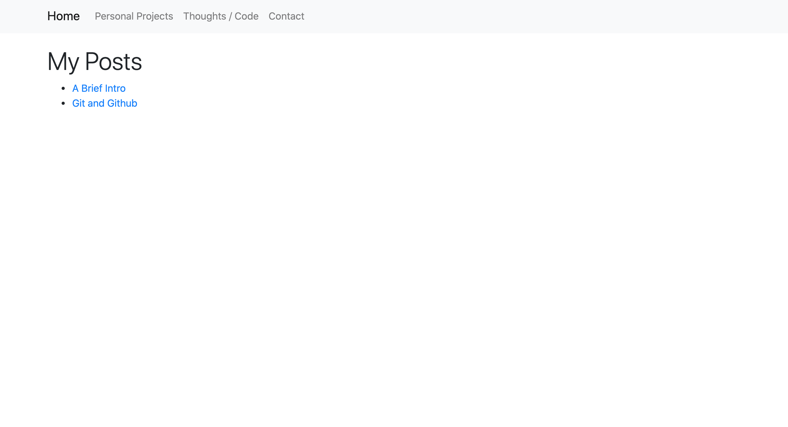

# Software Development Portfolio

My software development portfolio built with Svelte/Sapper.

## Instructions on how to get this application up and running

- git clone 
- npm install
- npm install —-save svelte sveltestrap (becasue I am using Sveltestrap)
- npm run dev

## Built With

- HTML
- CSS
- JavaScript
- Bootstrap 4.0+
- Sveltestrap
- Getform (handling the contact form)
- Deployed with Heroku

## Screenshots

Home Page

Projects Page

Posts Page

Contact Page
